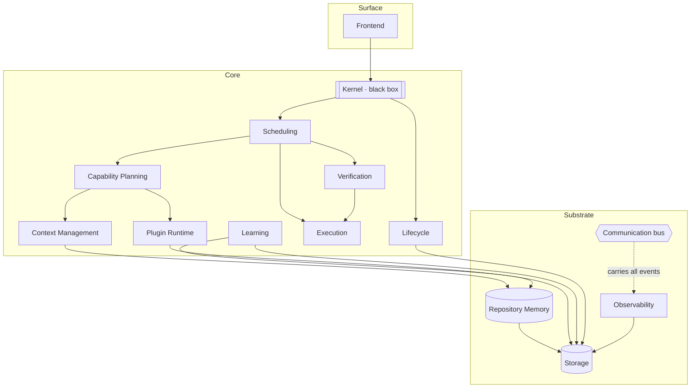
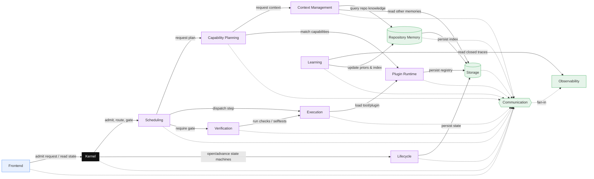
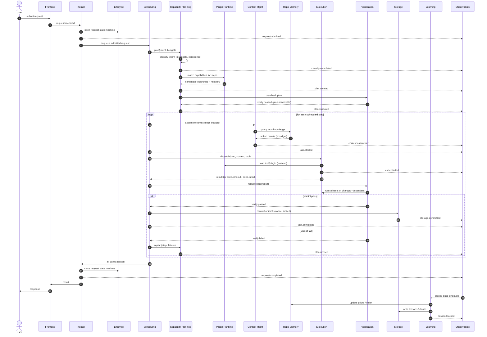
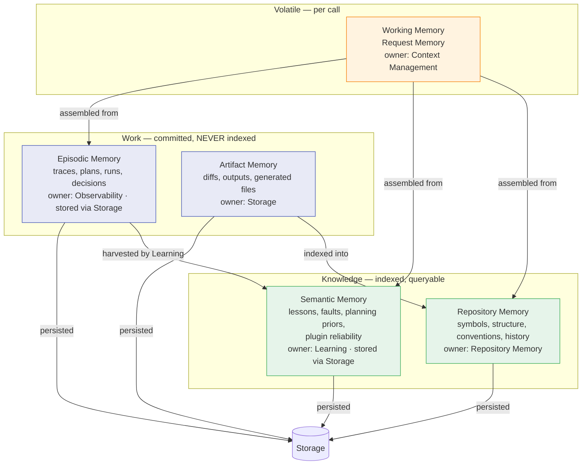
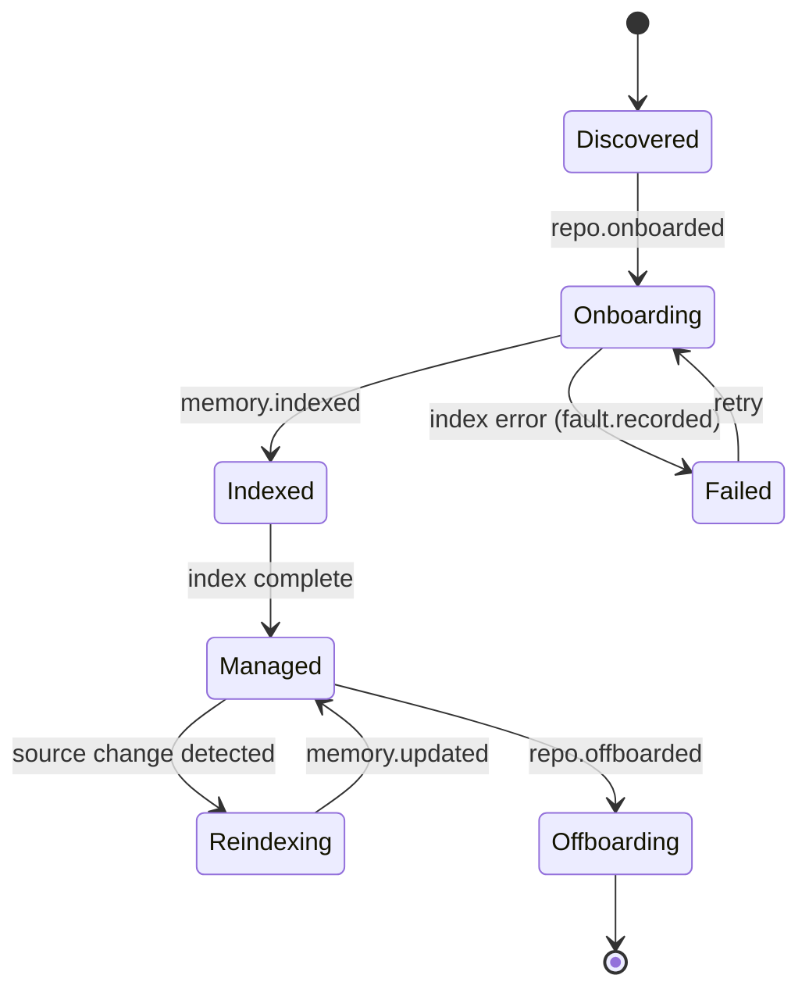
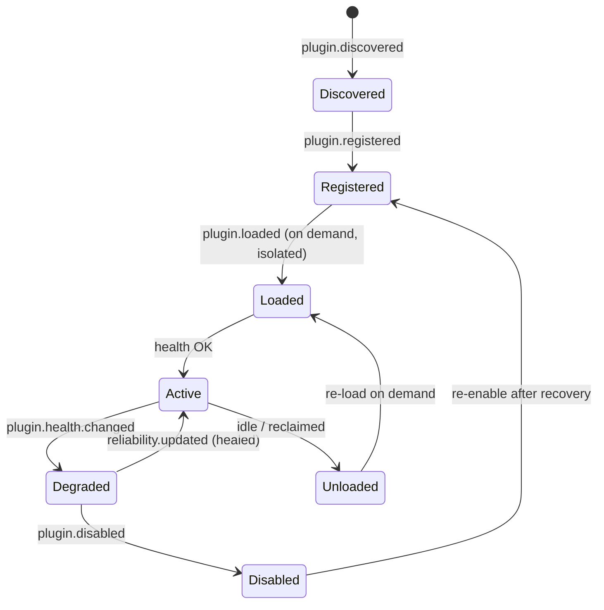
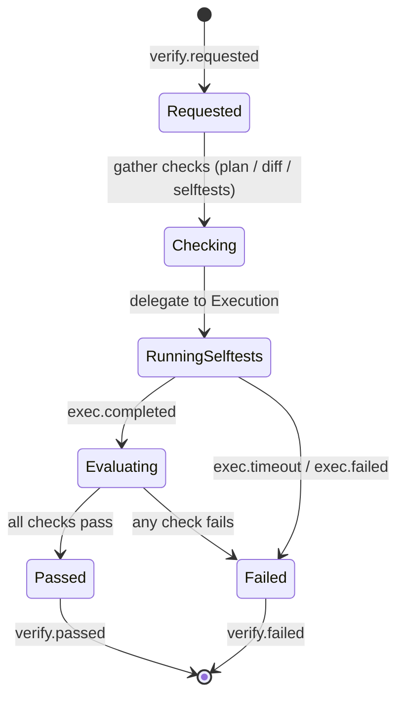

# ABSOLUTE-ZERO V2 — Architecture Specification

Authoritative architecture for the V2 Agentic Operating System. This document
defines system structure, the request lifecycle, the memory hierarchy, the
communication model, state ownership, key lifecycles, and data flows. It does
**not** contain implementation, code, or APIs-as-code. Per-component detail
lives in `COMPONENTS/*.md`.

The **Kernel is a black box** throughout: this document defines only its
boundaries and relationships. Its internal design is a separate later session.

**Contents**
1. [System overview](#system-overview)
2. [Component diagram](#component-diagram)
3. [Request lifecycle](#request-lifecycle)
4. [Memory hierarchy](#memory-hierarchy)
5. [Communication model](#communication-model)
6. [State ownership](#state-ownership)
7. [Lifecycles](#lifecycles)
8. [Data flows](#data-flows)
9. [Component summary](#component-summary)

---

## System overview

Three tiers: the **Surface** (Frontend), the **Core** (control plane +
intelligence + doing-work components), and the **Substrate** (shared services
every component depends on: Repository Memory, Storage, Communication,
Observability). The Kernel sits at the top of the Core as system authority.



**Invariants encoded above**

- All durable writes converge on **Storage** (single writer, Law 3).
- All external processes are spawned by **Execution** — including on
  Verification's behalf; Verification never spawns (Laws 3, and V1 fix H4).
- All repository knowledge is served by **Repository Memory** — no other arrow
  reads a repository (Law 2, V1 fix H2).
- Every component emits to **Observability** via the **Communication** bus
  (Law 7).

---

## Component diagram

Peer components and their principal relationships. Solid arrows are direct
query/command relationships; the bus (dashed) is the asynchronous event
channel that all components share.



---

## Request lifecycle

The full lifecycle of a user request, from admission to a committed, verified,
learned-from result. Note the **structural verification gate**: Scheduling
cannot mark a request complete until Verification has emitted `verify.passed`;
a `verify.failed` routes back to planning rather than forward to commit.



**Guarantees**

- **Unskippable gates (Law 4, fix H3):** the only edge from a step to
  `task.completed`/commit passes through `verify.passed`. Scheduling has no path
  that bypasses it.
- **Containment (fix H4):** `exec.timeout`/`exec.failed` are ordinary results
  Execution returns; they never crash Verification or the Scheduler.
- **Determinism (Law 6):** classification, capability matching, and context
  assembly are deterministic given identical Repository Memory state.

---

## Memory hierarchy

Five memory tiers, sharply separated by lifetime and by *what indexes them*.
The V1 discipline is preserved: **runtime artifacts are committed but never
indexed** — work memory and knowledge memory never mix.



| Tier | Lifetime | Indexed? | Owner | Written via | Purpose |
|------|----------|----------|-------|-------------|---------|
| **Working** | One LLM call | n/a (ephemeral) | Context Management | not persisted | Request Memory (formerly the Optimal Context Package): ranked, deduped, budget-fitted context for a single execution. |
| **Repository** | Life of the repo | Yes (the index) | Repository Memory | Storage | Shared semantic understanding of a managed repo: symbols, structure, conventions, history. **The only retrieval authority.** |
| **Semantic** | Cross-repo, durable | Yes | Learning | Storage | Lessons, faults, planning priors, plugin reliability. The compounding moat. |
| **Episodic** | Durable, append-only | **No** | Observability | Storage | Traces, plans, runs, decisions. Committed for audit/replay; never retrieved by similarity. |
| **Artifact** | Durable | **No** (until indexed as repo content) | Storage | Storage | Diffs, generated files, tool outputs. Code artifacts become Repository knowledge only by explicit indexing. |

**Why the split matters (fix H2, Law 2):** only Repository and Semantic tiers
are queryable by similarity, and only their owners index them. No component
scans Episodic/Artifact memory to "search" — that path caused V1's six
divergent retrieval implementations. All retrieval is Repository Memory's job.

---

## Communication model

**Communication** owns the event bus and message schema. It is the only
inter-component channel besides the direct query APIs individual components
define (chiefly Repository Memory's retrieval API and Storage's write API).

### Delivery semantics

| Property | Guarantee |
|----------|-----------|
| Ordering | Per-topic FIFO; total order not guaranteed across topics. |
| Delivery | **At-least-once** to durable subscribers; consumers must be idempotent (keyed by event id). |
| Durability | Events destined for Observability/Learning are persisted via Storage before ack. |
| Backpressure | Scheduling consumes admission events under budget; the bus signals backpressure rather than dropping. |
| Poison handling | Undeliverable events are dead-lettered and surface as `fault.recorded`. |
| Replay | Episodic persistence makes any topic replayable for audit and deterministic re-run. |

Two interaction styles coexist: **events** (asynchronous, fan-out, on the bus)
and **direct queries** (synchronous request/response, e.g. "assemble context",
"query repo", "commit"). Commands that mutate state are events; reads that need
an answer now are direct queries.

### Publish / consume matrix

Canonical event families, their publisher, and their principal consumers. This
is the shared vocabulary referenced by all component specs.

| Event | Published by | Consumed by |
|-------|--------------|-------------|
| `request.received` | Frontend | Kernel |
| `request.admitted` | Kernel | Scheduling, Lifecycle, Observability |
| `request.rejected` | Kernel | Frontend, Observability |
| `request.completed` | Kernel | Frontend, Learning, Observability |
| `request.failed` | Kernel | Frontend, Learning, Observability |
| `classify.completed` | Capability Planning | Scheduling, Observability |
| `plan.created` | Capability Planning | Verification, Scheduling, Observability |
| `plan.validated` | Verification | Scheduling, Observability |
| `plan.rejected` | Verification | Capability Planning, Observability |
| `plan.revised` | Capability Planning | Scheduling, Observability |
| `task.scheduled` | Scheduling | Execution, Observability |
| `task.started` | Scheduling | Observability |
| `task.preempted` | Scheduling | Execution, Observability |
| `task.completed` | Scheduling | Kernel, Learning, Observability |
| `task.failed` | Scheduling | Kernel, Capability Planning, Observability |
| `context.assembled` | Context Management | Execution, Observability |
| `exec.started` | Execution | Observability |
| `exec.completed` | Execution | Scheduling, Verification, Observability |
| `exec.timeout` | Execution | Scheduling, Observability |
| `exec.failed` | Execution | Scheduling, Observability |
| `verify.requested` | Scheduling | Verification, Observability |
| `verify.passed` | Verification | Scheduling, Kernel, Observability |
| `verify.failed` | Verification | Scheduling, Capability Planning, Observability |
| `memory.indexed` | Repository Memory | Observability, Learning |
| `memory.queried` | Repository Memory | Observability |
| `memory.updated` | Repository Memory | Context Management, Observability |
| `repo.onboarded` | Lifecycle | Repository Memory, Observability |
| `repo.offboarded` | Lifecycle | Repository Memory, Storage, Observability |
| `plugin.discovered` | Plugin Runtime | Lifecycle, Observability |
| `plugin.registered` | Plugin Runtime | Capability Planning, Observability |
| `plugin.loaded` | Plugin Runtime | Execution, Observability |
| `plugin.disabled` | Plugin Runtime | Scheduling, Capability Planning, Observability |
| `plugin.health.changed` | Plugin Runtime | Scheduling, Observability |
| `reliability.updated` | Learning | Plugin Runtime, Capability Planning, Observability |
| `lesson.learned` | Learning | Capability Planning, Observability |
| `fault.recorded` | Any (via Communication) | Observability, Learning |
| `storage.committed` | Storage | Observability |
| `storage.rejected` | Storage | Observability, requesting component |
| `telemetry.emitted` | Observability | (sink; dashboards read) |
| `cost.recorded` | Observability | Scheduling (budget), Frontend |
| `session.wake` | Lifecycle | Kernel, Observability |
| `session.sleep` | Lifecycle | Kernel, Observability |
| `state.updated` | Request State Manager | Frontend, Observability |
| `state.evicted` | Request State Manager | Observability |

---

## State ownership

Every piece of durable or authoritative state has **exactly one owner** (Law 1).
Owners are the source of truth; all durable bytes are physically written by
Storage on the owner's behalf. No two rows share a state.

| State | Sole owner | Physically written by |
|-------|-----------|-----------------------|
| Admission & routing authority; request identity | Kernel | (in-memory / via Storage) |
| Request / repo / plugin / session state machines | Lifecycle | Storage |
| Work order, priorities, budgets, preemption state | Scheduling | (in-memory) |
| Repository index, symbols, structure, conventions, history | Repository Memory | Storage |
| Plans, classification results, capability matches | Capability Planning | Storage |
| Plugin registry, versions, isolation, health scores | Plugin Runtime | Storage |
| Request Memory (ephemeral) | Context Management | not persisted |
| Verification verdicts | Verification | Storage |
| Process sandbox / timeout / retry state | Execution | (in-memory) |
| Lessons, faults, planning priors, plugin reliability | Learning | Storage |
| Config source of truth, vault layout, git integration, locks | Storage | Storage |
| Telemetry, metrics, token/cost accounting, audit log, episodic traces | Observability | Storage |
| Event schema, topic/subscription registry | Communication | Storage |
| Presented (read-only) view state | Frontend | never (reads only) |

**Non-duplication callouts** (the V1 drift this kills):

- **Retrieval/similarity** exists in exactly one place: Repository Memory
  (kills H2's six implementations).
- **Durable writes** exist in exactly one place: Storage (kills H5 lost updates).
- **Process spawning** exists in exactly one place: Execution (kills H4).
- **Context assembly** exists in exactly one place: Context Management — it
  builds Request Memory and nothing else builds it.
- **Prompt compilation** exists in exactly one place: the Prompt Compiler
  (future Execution Service) — it consumes Request Memory, never builds it.
- **Config** has one source of truth: Storage (kills M4 duplication).
- **Telemetry** has one schema and one sink: Observability (kills M8 scatter).

---

## Lifecycles

### Repository lifecycle

A repository under management moves through onboarding (full index build) to a
steady managed state, with incremental re-index on change, to offboarding.
Repository Memory owns the index; Lifecycle owns transition legality.



### Plugin lifecycle

Plugins/tools/skills are discovered, registered into the capability registry,
loaded into isolation on demand, health-tracked, and disabled when unhealthy —
with reliability that heals over time via Learning.



### Verification lifecycle

Every verifiable object (plan, diff, artifact) passes through the same
mechanical gate. Verification delegates all process execution (e.g. running
selftests) to Execution and emits a verdict as an event the Scheduler/Kernel
enforce.



---

## Data flows

### Context assembly (retrieval → Request Memory)

Shows Law 2 in action: Context Management is the sole assembler, Repository
Memory is the sole retriever, budget is a hard ceiling.

```mermaid
flowchart LR
    step[Step + token budget] --> CTX[Context Management]
    CTX -->|query| MEM[(Repository Memory)]
    CTX -->|read lessons/priors| SEM[(Semantic memory · via Storage)]
    CTX -->|read prior decisions| EPI[(Episodic · via Storage)]
    MEM -->|ranked results ≤25-token summaries| CTX
    CTX -->|rank · dedup · fit budget · fidelity tiers| RQM[Request Memory]
    RQM --> LLM[[LLM call · model-agnostic iface]]
    CTX -.context.assembled.-> OBS[Observability]
```

### Learning loop (close the loop, never repeat a mistake)

```mermaid
flowchart LR
    OBS[(Episodic traces · Observability)] -->|closed trace| LRN[Learning]
    LRN -->|distill| L1[lessons]
    LRN -->|distill| L2[faults]
    LRN -->|distill| L3[pattern stats]
    L1 --> MEM[(Semantic / priors)]
    L2 --> MEM
    L3 --> PLG[Plugin Runtime reliability]
    LRN -->|write| STO[(Storage)]
    LRN -.reliability.updated / lesson.learned.-> BUS{{Communication}}
    BUS --> CP[Capability Planning priors]
```

### Write path (single writer)

```mermaid
flowchart LR
    A[Any component with state to persist] -->|write request| STO[(Storage)]
    STO -->|acquire lock| L[lock]
    STO -->|atomic write + txn| DISK[(Vault / git)]
    STO -.storage.committed.-> OBS[Observability]
    STO -.storage.rejected on conflict.-> A
```

---

## Component summary

| Component | One-line responsibility | Spec |
|-----------|-------------------------|------|
| Kernel | System authority (black box): admits/routes requests, mediates lifecycle gates. | [kernel.md](COMPONENTS/kernel.md) |
| Repository Memory | Single retrieval/similarity/index authority; all repo knowledge. | [memory.md](COMPONENTS/memory.md) |
| Scheduling | Orders and admits work; priorities, budgets, preemption, backpressure; enforces gates. | [scheduling.md](COMPONENTS/scheduling.md) |
| Execution | Sole process spawner; sandbox, timeouts, retries, caps, failure containment. | [execution.md](COMPONENTS/execution.md) |
| Capability Planning | Intent → validated plans; classification, decomposition, capability matching, confidence. | [capability-planning.md](COMPONENTS/capability-planning.md) |
| Plugin Runtime | Discovers/loads/isolates/versions plugins; capability registry; self-healing reliability. | [plugin-runtime.md](COMPONENTS/plugin-runtime.md) |
| Context Management | Sole assembler of Request Memory; ranking, dedup, budget, freshness. Prompt compilation deferred to future Prompt Compiler service. | [context-management.md](COMPONENTS/context-management.md) |
| Verification | Mechanical gates on plans/diffs/artifacts/selftests; verdicts as enforced events. | [verification.md](COMPONENTS/verification.md) |
| Learning | Harvests closed traces into lessons/faults/priors; updates reliability. | [learning.md](COMPONENTS/learning.md) |
| Storage | Sole durable-write authority; atomic/locked/transactional; config source of truth. | [storage.md](COMPONENTS/storage.md) |
| Frontend | User surfaces (CLI, dashboard); presents state, never owns it. | [frontend.md](COMPONENTS/frontend.md) |
| Communication | Event bus + message schema; pub/sub contracts; delivery guarantees. | [communication.md](COMPONENTS/communication.md) |
| Lifecycle | State machines for long-lived things; owns transition legality. | [lifecycle.md](COMPONENTS/lifecycle.md) |
| Observability | Unified telemetry: traces, metrics, token/cost accounting, audit log; one schema, one sink. | [observability.md](COMPONENTS/observability.md) |
| Request State Manager | Single source of truth for runtime request state; event-sourced materialized view, journal, replay. | [RSM/](RSM/01-problem-definition.md) |
