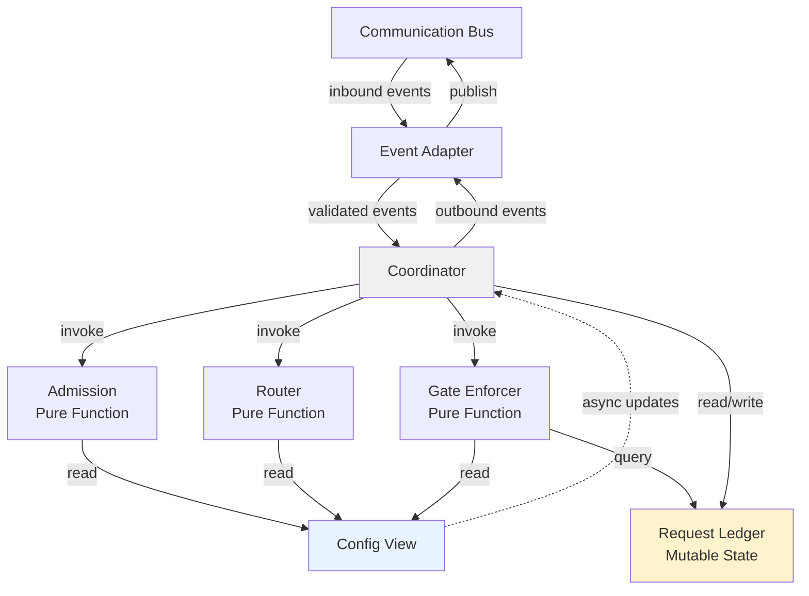

# Kernel — Phase 2: Internal Architecture

## Overview

Single-threaded, event-driven coordinator. Six internal modules enforce admission, routing, and gate decisions mechanically (table lookup or boolean only). Coordinator is the sole event processor; all others are pure functions over immutable Config View and mutable Request Ledger.

---

## Module Definitions

### 1. Event Adapter

**Why it exists:** Sole seam between Kernel and Communication bus. Decouples synchronous pure logic from asynchronous event transport.

**Boundary:**
- Does: Subscribe to Communication, validate inbound event envelopes against schema, deserialize, hand to Coordinator. Receive outbound events from Coordinator, serialize, publish to bus.
- Never: Parse event content beyond envelope validation, route or admit, mutate Ledger, inspect policy.

**Dependencies:** Communication contract (envelope structure, schema registry).

**Communication:** Receives all inbound events (request.received, verify.*, plan.*, config.changed). Returns outbound events (request.admitted, request.rejected, gate.enforced) to Coordinator for transport.

---

### 2. Admission

**Why it exists:** Mechanical enforcement of two-clause contract: envelope schema-valid AND system not halted. Nothing discretionary.

**Boundary:**
- Does: Validate request.received envelope schema against Config View. Check halt flag (Coordinator state). Emit request.admitted or request.rejected with reason.
- Never: Inspect request payload, apply quotas or capacity checks, embed policy content in code (all policy lives in Config View).

**Dependencies:** Config View (request schemas), Coordinator halt flag (input), envelope (input).

**Communication:** Receives (envelope), returns (boolean + reason: admit or reject).

---

### 3. Router

**Why it exists:** Deterministic, auditable routing. Static lookup from configuration, never content inspection or intent inference.

**Boundary:**
- Does: Look up request.type in Config View routing table → owning component name. Emit routing decision or rejection.
- Never: Inspect request content, infer intent or classification, fall back to heuristics, guess ambiguous targets.

**Dependencies:** Config View (routing table), request.type (input).

**Communication:** Receives (type string), returns (component name or rejection with reason).

---

### 4. Gate Enforcer

**Why it exists:** Lifecycle owns gate definitions; Kernel applies them without discretion.

**Boundary:**
- Does: Apply gate definitions from Config View against verdict bookkeeping in Request Ledger. Query which verdicts (verify.passed, verify.failed) have arrived. Emit gate.enforced (permit or block).
- Never: Define which gates exist, skip missing verdicts, default missing verdicts to permit.

**Dependencies:** Config View (gate definitions), Request Ledger (verdict state), request id and gate name (inputs).

**Communication:** Receives (request id, gate, stage), returns (permit or block), emits gate.enforced decision to Coordinator.

---

### 5. Request Ledger

**Why it exists:** Single source of coordination state: request id → {lifecycle stage, pending gates, arrived verdicts}.

**Boundary:**
- Does: Store in-memory bookkeeping. Coordinator only writer; all modules read. Query: verdicts arrived, stage, pending gates.
- Never: Write to durable storage (Storage owns durability), define gate structure (Lifecycle owns it), apply gates (Gate Enforcer does).

**Dependencies:** None (mutable store; Coordinator is only writer).

**Communication:** Receives updates from Coordinator (request admitted → entry created; verdicts.received → update verdicts). Returns query results (stage, gates, verdict state).

---

### 6. Coordinator

**Why it exists:** Single deterministic event loop. All decisions happen here sequentially; no parallelism, no timers, events processed in arrival order.

**Boundary:**
- Does: Pull validated events from Event Adapter, invoke Admission/Router/Gate Enforcer sequentially, apply Ledger mutations, emit outbound events to Event Adapter. Hold halt flag; halt admission on enumerated deterministic triggers only (Communication unavailable, Kernel fault).
- Never: Perform I/O, query external state, compute verdicts, define gates, make policy decisions beyond those three pure modules.

**Dependencies:** Event Adapter (pull/push), Admission/Router/Gate Enforcer (call as functions), Request Ledger (read/write), Config View (read).

**Communication:** Receives (validated events from Event Adapter). Returns (outbound: request.admitted, request.rejected, gate.enforced). Emits halt signal on configured triggers.

---

## Config View (Read-Only Data Facet)

Not a module; an immutable data snapshot received from Storage or Lifecycle via config.changed events:
- Request envelope schemas (Admission validates against).
- Routing table: request.type → owning component.
- Gate definitions: per lifecycle stage, which verdicts gate which transitions.

Never written by Kernel; updates arrive asynchronously as config.changed events.

---

## Event Flow Diagram

---

## Dependency Rules Table

| Dependent | Dependency | Access | Reason |
|-----------|-----------|--------|---------|
| Coordinator | Event Adapter, Admission, Router, Gate Enforcer, Request Ledger, Config View | R/W | Sole event loop; orchestrates all others; only writer to Ledger. |
| Admission | Config View, halt flag | R | Pure function: schema validation only. No state side effects. |
| Router | Config View | R | Pure function: static lookup only. No state side effects. |
| Gate Enforcer | Config View, Request Ledger | R | Pure function: verdict check against policy. No Ledger writes. |
| Event Adapter | Communication | R/W | Sole bus boundary. No internal module dependencies. |
| Request Ledger | — | — | Mutable store. Coordinator is sole writer; all modules read. |
| Config View | Storage, Lifecycle (async events) | — | Read-only; updated only via config.changed events. |

**Cycle detection:** All intra-module arrows point toward Coordinator or remain within module. Communication and Config View flow inbound only. Zero cycles.

---

## Why Nothing More

**No scheduler module:** Scheduling component owns priority, backpressure, budget allocation, and work distribution. Kernel emits routing events; Scheduling decides execution order.

**No persistence module:** Storage owns durability. Kernel emits Request Ledger mutations as events; Storage consumes and persists them.

**No retry or timeout module:** Phase 7 (Fault Handling) places retry and timeout policy into Config View as data structures (e.g., gate definitions with timeout semantics). Coordinator applies them deterministically.

**No plugin or LLM module:** Domain work is delegated to peer components: Capability Planning (planning, classification), Verification (verdict computation), Execution (work spawning).

Kernel is coordination machinery only — the *how*, never the *what*.
