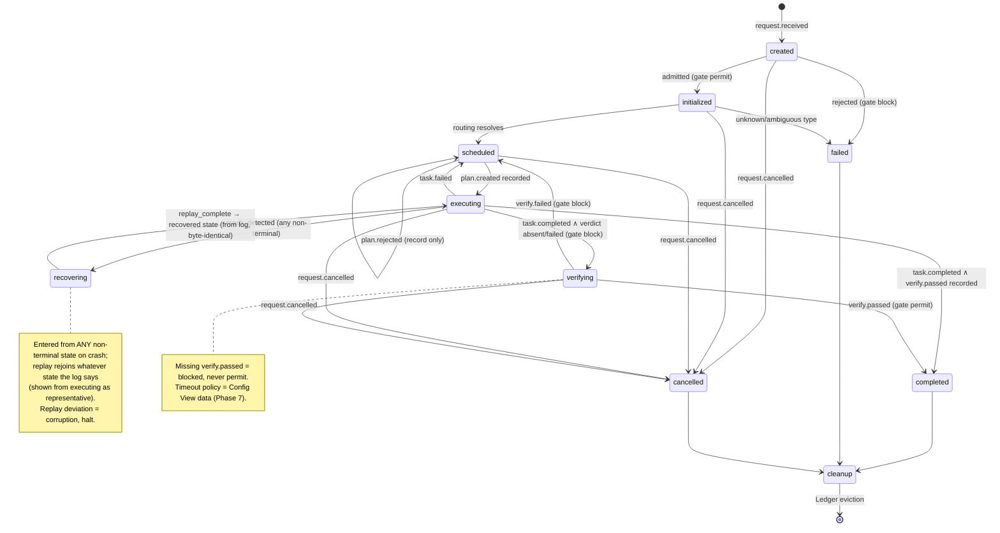

# Kernel — Phase 3: Execution Lifecycle

## Overview

The **Lifecycle component** owns the request state machine: which states exist, which transitions are legal, which gates protect which transitions. The state machine is configuration data delivered via Config View.

The **Kernel Coordinator** owns *enforcement*: applying transitions mechanically when consumed events arrive, checking guards (table lookup or boolean only), and recording current state in the Request Ledger. The Kernel never defines legality, only enforces it. Lifecycle *policy*; Kernel *mechanics*.

---

## States and Ownership

The Kernel only tracks; the named component does the actual work while the request sits in that state.

| State | Meaning | Component doing work | Terminal? |
|-------|---------|----------------------|-----------|
| `created` | request.received arrived; admission under evaluation | Kernel | No |
| `initialized` | Admitted; routing lookup in the same event processing | Kernel | No |
| `scheduled` | Routed; awaiting a validated plan / re-plan | Capability Planning, Verification | No |
| `executing` | Plan recorded; work dispatched and running | Scheduling, Execution | No |
| `verifying` | Task done but completion gate blocked; waiting for verdict | Verification | No |
| `completed` | Completion gate passed | — | **Yes** |
| `failed` | Rejected or unrecoverable | — | **Yes** |
| `cancelled` | Cancellation acknowledged | — | **Yes** |
| `cleanup` | Kernel-internal Ledger eviction after a terminal state | Kernel | Leads to eviction |
| `recovering` | Ledger rebuild by replay after crash | Kernel | Rejoins recovered state |

---

## Deterministic Transition Table

Triggers are Kernel-**consumed** events only; emissions are Kernel-**published** events only (see Event Vocabulary). Guards are table lookups or booleans against Config View / Ledger — never judgment.

| Current | Trigger event | Guard | Next | Emitted |
|---------|--------------|-------|------|---------|
| created | request.received | schema_valid ∧ ¬halted | initialized | request.admitted, gate.enforced (permit) |
| created | request.received | ¬schema_valid ∨ halted | failed | request.rejected, gate.enforced (block) |
| created | request.cancelled | — | cancelled | request.cancelled (ack), gate.enforced |
| initialized | (same event processing: routing lookup) | type in routing table | scheduled | routing directive via Communication |
| initialized | (routing lookup) | unknown ∨ ambiguous type | failed | request.rejected, gate.enforced (block) |
| initialized | request.cancelled | — | cancelled | request.cancelled (ack), gate.enforced |
| scheduled | plan.created | — | executing | (Ledger bookkeeping; Scheduling owns dispatch) |
| scheduled | plan.rejected | — | scheduled | (record in Ledger; revision loop is Capability Planning ↔ Verification, not Kernel) |
| scheduled | request.cancelled | — | cancelled | request.cancelled (ack), gate.enforced |
| executing | verify.passed / verify.failed | — | executing | (record verdict in Ledger; no transition) |
| executing | task.completed | verify.passed recorded | completed | request.completed, gate.enforced (permit) |
| executing | task.completed | verdict absent ∨ verify.failed recorded | verifying | gate.enforced (block) |
| executing | task.failed | — | scheduled | (Capability Planning also consumes task.failed and replans) |
| executing | request.cancelled | — | cancelled | request.cancelled (ack), gate.enforced |
| verifying | verify.passed | — | completed | request.completed, gate.enforced (permit) |
| verifying | verify.failed | — | scheduled | gate.enforced (block); replan happens in Capability Planning |
| verifying | request.cancelled | — | cancelled | request.cancelled (ack), gate.enforced |
| completed / failed / cancelled | request.cancelled | — | (no-op) | — |
| completed / failed / cancelled | (terminal reached) | — | cleanup | (nothing new; request.completed/failed already emitted) |
| cleanup | (eviction done) | — | evicted `[*]` | — |
| [ANY non-terminal] | crash_detected | — | recovering | fault.recorded |
| recovering | replay_complete | replay byte-identical | [recovered state from log] | (resume normal flow) |
| recovering | replay_complete | replay deviates | halted | fault.recorded |

**Missing verdict at a gate = blocked.** The request stays in `verifying` until the verdict arrives — never defaults to permit. Timeout policy is Config View data (Phase 7 fault handling); when configured it produces a deterministic block → `failed` transition. Likewise, retry/exhaustion policy that turns repeated `task.failed` into terminal `failed` is Config View data, deferred to Phase 7.

**Ambiguity = reject, never guess.** Any event/state pair not in the table is a fault: `fault.recorded`, request state unchanged.

---

## Gate Placement

All gates are `gate.enforced`-emitting decisions, permit or block. Per ARCHITECTURE.md: a plan must pass verification before scheduling proceeds; task completion requires `verify.passed`; `verify.failed` routes back toward planning, never forward.

1. **Admission gate** (created → initialized): schema valid ∧ not halted.
2. **Routing gate** (initialized → scheduled): declared type resolves in routing table.
3. **Plan gate** (scheduled → executing): `plan.created` recorded; on `plan.rejected` the request holds in `scheduled` while Capability Planning ↔ Verification revise — the Kernel only records.
4. **Completion gate** (→ completed): `task.completed` requires a recorded `verify.passed`. On `verify.failed` the request returns to `scheduled`; the Kernel only records and gates — plan revision is Capability Planning's, triggered by its own consumption of `verify.failed` / `task.failed`.

---

## Crash Recovery (per Phase-2 D2)

- Request Ledger is in-memory current state only; every transition is emitted as an immutable event; Storage persists the transition log.
- On restart the transition log is replayed to the Kernel via Communication (Storage publishes the replay stream) — the read path stays event-based; the Kernel calls no retrieval API.
- Recovery = rebuild the Ledger by replaying transitions sequentially. Replayed decisions must be **byte-identical** to the log (determinism law); deviation = corruption → `fault.recorded`, admission halted.
- Closed requests are evicted from memory after `cleanup`; the Ledger holds only active requests.

---

## Cancellation

`request.cancelled` is legal from **every** non-terminal state (created, initialized, scheduled, executing, verifying); terminal states are a no-op. Cancellation propagates as events to owning components — Scheduling and Execution actually stop the work (the Kernel never spawns or kills processes). The request still passes through `cleanup` before eviction; no request is orphaned.

---

## Event Vocabulary

Exactly the ARCHITECTURE.md matrix, restricted to the Kernel's rows:

**Kernel consumes:** `request.received`, `plan.created`, `plan.rejected`, `task.completed`, `task.failed`, `verify.passed`, `verify.failed`, `session.wake`, `session.sleep`, `config.changed`.

**Kernel publishes:** `request.admitted`, `request.rejected`, `request.completed`, `request.failed`, `gate.enforced`; plus `fault.recorded` (publishable by any component).

**NEW event extending the matrix:** `request.cancelled` — consumed by the Kernel as the cancellation trigger and published as the acknowledgement; propagated to Scheduling/Execution so they stop work. This is the only addition to the canonical vocabulary.

`exec.*`, `verify.requested`, `plan.revised`, `plan.validated`, `task.scheduled`, `task.started`, `task.preempted`, `storage.committed` exist in the system matrix but the Kernel neither consumes nor publishes them — they belong to Scheduling, Capability Planning, Verification, Execution, and Storage.

Requests are opaque typed work; no domain terms anywhere in this machine.

---

## State Machine Diagram

---

## Design Decisions (Phase 3)

**D3a — Completion gate on recorded verdicts.** Verdicts arrive as events and are recorded in the Ledger; `task.completed` is checked against the recorded `verify.passed`. The only path to `completed` passes this gate (fixes V1-H3 structurally).

**D3b — Recovery via event replay.** Log is durable (Storage), Ledger is ephemeral. Replay through Communication keeps the Kernel free of retrieval calls and makes determinism testable: identical log → identical Ledger, byte-for-byte.

**D3c — Cancellation as a first-class event.** `request.cancelled` flows through the same table as everything else, legal from every non-terminal state; owning components stop the work, the Kernel only transitions and gates.
