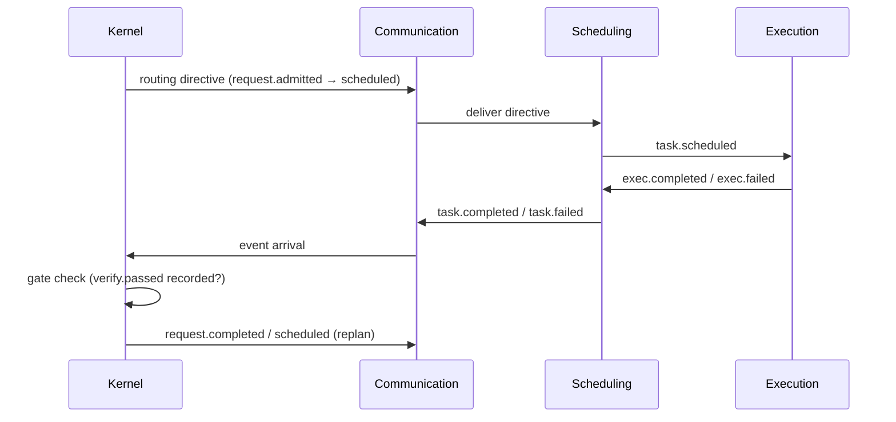

# Kernel — Phase 5: Scheduling & Dispatch Boundary

**Core thesis:** Kernel dispatches admitted work exactly once via routing directive (Phase 3: initialized → scheduled); everything after is Scheduling's. Single ownership, no overlap.

---

## Ownership Split

| Concern | Owner | Kernel's role |
|---------|-------|---------------|
| Queue policy + priorities | Scheduling | None — emits routing directive, never orders work |
| Task dependencies | Capability Planning (DAG) + Scheduling (order) | Tracks request-level lifecycle state only (Phase 3) |
| Parallelism / worker pools | Scheduling + Execution | Single-threaded; interleaves per-request events (Phase 2, D1) |
| Sub-agent spawning | Execution (sole spawner per Law 3) | Never spawns; work rolls up as task.completed/failed |
| Resource budgets / backpressure | Scheduling consumes admission under budget | Admission is schema + halt only; capacity rejection is Scheduling backpressure, never Kernel |
| Retries | Config View (Phase 7, Policy data) | Applies table deterministically, never decides |
| Cancellation | Kernel transitions + propagates request.cancelled | Scheduling/Execution stop actual work |
| Event ordering | Communication (per-topic FIFO) | Processes arrival order |

---

## Dispatch Contract (Kernel's One Ownership)

After **routing gate** (Phase 3, initialized → scheduled), Kernel emits **exactly one routing directive** per admitted request:

- **Contents:** request id, declared type, routing target component, config version.
- **Delivery:** Via Communication to owning component (Scheduling or Capability Planning).
- **Semantics:** Fire-and-forget. Progress returns only as events (plan.created, task.scheduled, task.completed, ...). No polling, callbacks, or shared state.
- **Idempotence:** Stored in transition log before publish; on crash, unpublished directives re-emitted; Scheduling dedups by event id (at-least-once contract per ARCHITECTURE.md).

---

## What Kernel Refuses (and Why)

- **No priority queue:** Scheduling owns ordering; a Kernel queue duplicates ABSOLUTE-ZERO V1's god-module drift.
- **No sub-request dependencies:** Kernel tracks request, not task graph. Plan DAG lives in Capability Planning.
- **No worker awareness:** Execution is opaque; Kernel never inspects pool state or capacity.
- **No retry exhaustion:** Config View data gates policy; Kernel applies, never counts or decides.

---

## Interaction Sequence

---

## Design Decision D5a — Dispatch: At-Least-Once Delivery, Exactly-Once Effect

**Claim:** Kernel's routing directive is emitted at least once despite crashes; Scheduling's event-id dedup makes the effect exactly-once.

**Method:** Directive emission recorded in transition log *before* publish to Communication. On restart, Storage replays the transition log; unpublished directives are re-emitted. Scheduling deduplicates by event id (idempotent handler per ARCHITECTURE.md). Crash between Kernel's log write and Communication's publish = safe replay; crash between Communication publish and Kernel knowing = duplicate emission + dedup.

**Boundary:** Deterministic only at Kernel/log boundary. Communication and downstream handle idempotence. No shared state; no polling for ack.
