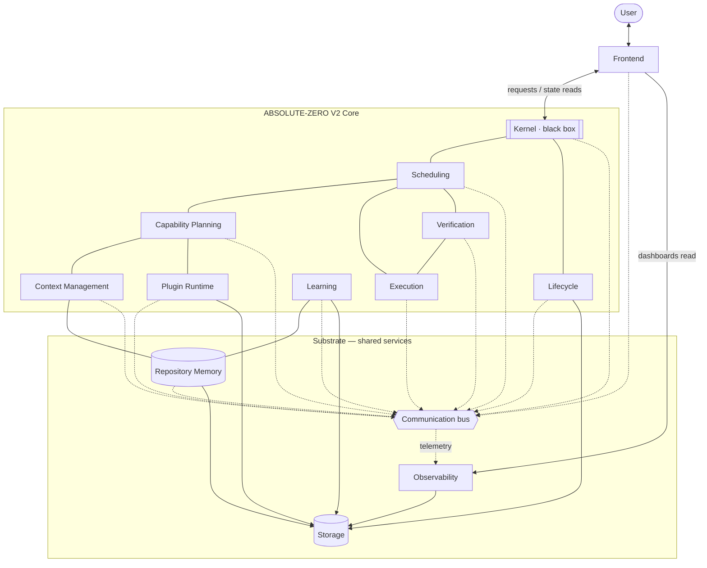

# ABSOLUTE-ZERO V2

> A deterministic **Agentic Operating System**. The LLM is the CPU, deterministic
> engines are the syscalls, and a structured vault is the memory.

ABSOLUTE-ZERO treats an LLM the way an OS treats a processor: powerful but
untrusted, fast but forgetful, and never allowed to touch durable state
directly. Everything the model cannot be trusted to do deterministically —
writing to disk, spawning processes, retrieving repository knowledge,
enforcing verification — is handled by deterministic peer components behind
strict boundaries. The model reasons; the OS remembers, verifies, and enforces.

**Motto:** *never pay for the same mistake twice; out-orchestrate SOTA agents
rather than out-model them.*

V1 was a self-hosted research prototype (external audit: 69/100). V2 is the
production-grade redesign that keeps V1's proven strengths and structurally
eliminates the failure classes that capped it.

---

## Philosophy

- **The model is a CPU, not an oracle.** It is model-agnostic: any LLM that can
  drive a shell can run the OS. We do not bet on a single frontier model; we
  bet on orchestration around whichever model is present.
- **Determinism around a stochastic core.** Given the same inputs, routing, the
  assembled context package, and verification verdicts are identical. The only
  non-determinism lives inside the LLM call itself, fenced on all sides.
- **Memory is the moat.** Closed work becomes lessons, faults, and reliability
  priors. The system's edge compounds over time, not per-prompt.
- **Boundaries over trust.** No component is trusted to stay in its lane by
  convention. Ownership is singular and mechanically enforced: one writer, one
  process spawner, one retrieval authority, one bus.

## Goals

1. **Out-orchestrate, not out-model.** Beat stronger single-model agents through
   memory, planning, verification, and context discipline.
2. **Never repeat a mistake.** Every closed trace feeds Learning; faults and
   reliability scores change future routing.
3. **Structural safety.** Verification cannot be skipped, disk cannot be
   corrupted, processes cannot escape containment — because the architecture
   makes those states unreachable, not because policy forbids them.
4. **Portability.** Model-agnostic, machine-agnostic, multi-agent safe.
5. **Total observability.** Every action is a telemetry event with computable
   token and cost accounting.

## Design principles — the Global Laws

These seven laws are stated here and enforced in every component specification.

1. **Single Responsibility.** No duplicated ownership, execution, retrieval,
   planning, or prompt generation anywhere. No component re-scans a repository.
2. **Repository Memory is the only source of repository knowledge.** Every
   subsystem queries it; no subsystem implements its own similarity, index, or
   repo scan.
3. **One writer, one spawner, one bus.** **Storage** is the only component that
   writes durable state. **Execution** is the only component that spawns
   external processes. **Communication** is the only inter-component bus.
4. **Verification gates are structurally unskippable.** Verdicts are events the
   Kernel and Scheduler enforce; work cannot be scheduled around a required gate.
5. **Model independence.** Any component touching an LLM does so behind a
   model-agnostic interface, with explicit token budgets everywhere.
6. **Determinism.** Same inputs → same routing, same context package, same
   verdicts.
7. **Everything observable.** Every component emits events to Observability;
   nothing acts silently.

---

## High-level architecture

The **Kernel** is a small black box: system authority that admits/routes
requests and mediates lifecycle gates. Every other subsystem is a peer that
communicates over the **Communication** event bus, plus the direct query APIs
each peer defines (notably Repository Memory's retrieval API).

**Read the diagram as:** the Kernel admits a request → Capability Planning turns
intent into a validated plan → Scheduling orders the work under budgets →
Context Management assembles the Optimal Context Package from Repository Memory →
Execution runs tools/processes → Verification gates the result → Learning
harvests the closed trace. Storage writes it all; Communication carries every
event; Observability sees everything.

---

## Development roadmap (summary)

Build order follows the dependency graph: substrate first, intelligence last.

| Phase | Theme | Components |
|-------|-------|-----------|
| 0 | Foundations | Storage, Communication, Observability |
| 1 | Knowledge | Repository Memory |
| 2 | Control plane | Kernel boundary, Scheduling |
| 3 | Doing work | Execution, Verification |
| 4 | Intelligence | Capability Planning, Context Management |
| 5 | Extensibility | Plugin Runtime |
| 6 | Compounding & lifecycle | Learning, Lifecycle |
| 7 | Surface | Frontend |

Each phase has hard exit criteria and integrates against everything below it.
Full detail — milestones, testing order, integration order, exit criteria — is
in **[ROADMAP.md](ROADMAP.md)**.

---

## Documentation map

| Doc | What it covers |
|-----|----------------|
| **[ARCHITECTURE.md](ARCHITECTURE.md)** | The official architecture spec: system & component diagrams, request lifecycle, memory hierarchy, event bus & delivery semantics, state ownership, lifecycle state machines, data flows. |
| **[ROADMAP.md](ROADMAP.md)** | Development phases, milestones, component implementation order, testing & integration order, per-phase exit criteria. |
| **COMPONENTS/** | One spec per component (a peer author owns these): |

### Component specs

| File | Component |
|------|-----------|
| [COMPONENTS/kernel.md](COMPONENTS/kernel.md) | Kernel — system authority (black box) |
| [COMPONENTS/memory.md](COMPONENTS/memory.md) | Repository Memory — single retrieval authority |
| [COMPONENTS/scheduling.md](COMPONENTS/scheduling.md) | Scheduling — ordering, budgets, backpressure |
| [COMPONENTS/execution.md](COMPONENTS/execution.md) | Execution — sole process spawner |
| [COMPONENTS/capability-planning.md](COMPONENTS/capability-planning.md) | Capability Planning — intent → validated plans |
| [COMPONENTS/plugin-runtime.md](COMPONENTS/plugin-runtime.md) | Plugin Runtime — plugins/tools/skills registry |
| [COMPONENTS/context-management.md](COMPONENTS/context-management.md) | Context Management — Optimal Context Package |
| [COMPONENTS/verification.md](COMPONENTS/verification.md) | Verification — mechanical gates |
| [COMPONENTS/learning.md](COMPONENTS/learning.md) | Learning — traces → lessons/priors |
| [COMPONENTS/storage.md](COMPONENTS/storage.md) | Storage — sole durable-write authority |
| [COMPONENTS/frontend.md](COMPONENTS/frontend.md) | Frontend — user surfaces |
| [COMPONENTS/communication.md](COMPONENTS/communication.md) | Communication — event bus |
| [COMPONENTS/lifecycle.md](COMPONENTS/lifecycle.md) | Lifecycle — state machines |
| [COMPONENTS/observability.md](COMPONENTS/observability.md) | Observability — unified telemetry |

---

## Event vocabulary

One dotted event vocabulary is shared across all docs and specs. Canonical
families: `request.*`, `classify.*`, `plan.*`, `task.*`, `exec.*`, `verify.*`,
`context.*`, `memory.*`, `repo.*`, `plugin.*`, `reliability.*`, `lesson.*`,
`fault.*`, `storage.*`, `telemetry.*`, `cost.*`, `session.*`. The authoritative
publish/consume matrix is in [ARCHITECTURE.md](ARCHITECTURE.md#communication-model).
