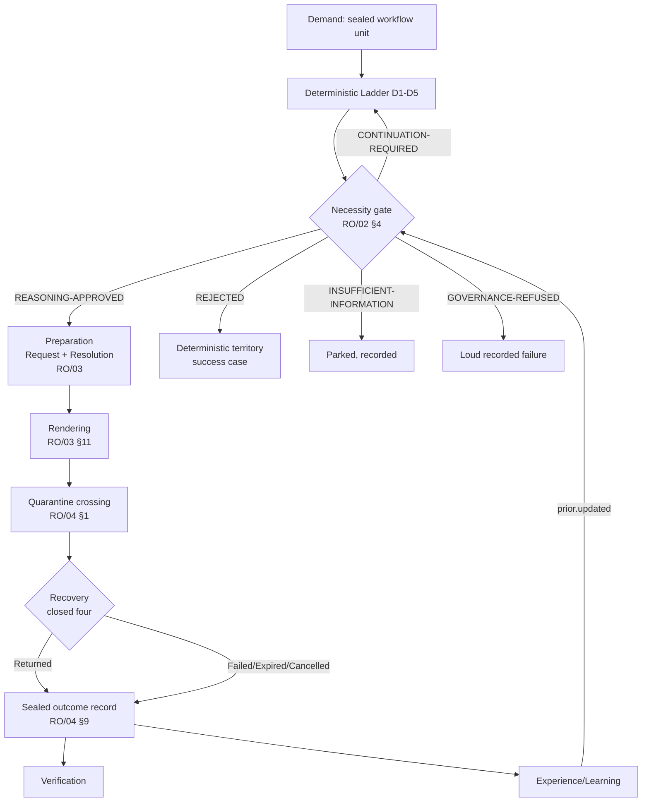

# Reasoning Orchestrator (RO) — Architecture Index

Entry point for implementers. RO governs reasoning as a scarce, metered
computational resource: whether it is needed, which capability and provider
it needs, what crosses the quarantine, how the crossing is governed, and how
the whole subsystem weaves into the rest of the OS. This index makes no new
architectural decisions — it is a map over RO/00-05, the frozen canon.

---

## Document Map

| Doc | Concern |
|---|---|
| [RO/00](00-architectural-foundation.md) | Mission, philosophy, position, boundaries, responsibilities, foundation invariants (RO-I) |
| [RO/01](01-reasoning-capability-model.md) | The language of reasoning: admission test, Information Boundary, capability model, taxonomy, complexity ladder (RO-C) |
| [RO/02](02-reasoning-decision-architecture.md) | The necessity gate: decision principles, valid/forbidden inputs, five closed outcomes, Deterministic Ladder, granularity (RO-D) |
| [RO/03](03-request-preparation.md) | The artifact: Reasoning Request + Provider Resolution, capability matching, provider selection, context/reduction/budget, schemas, renderers (RO-P) |
| [RO/04](04-execution-governance.md) | The crossing: invocation, retry, failure taxonomy F1-F8, timeout, cancellation, composite reasoning, sealed outcome records (RO-E) |
| [RO/05](05-system-integration.md) | The weave: event canon, RSM mirroring, Verification handoff, Experience feedback, observability, metrics, evolution, errata, blueprint (RO-S) |

---

## Where to Find Each Concern

| Concern | Doc |
|---|---|
| Capability model, taxonomy, complexity levels | RO/01 |
| Necessity, decision outcomes, deterministic ladder | RO/02 |
| Request artifact, Provider Resolution, context, budget, schema, renderer | RO/03 |
| Attempts, failure classes, timeouts, cancellation, composites | RO/04 |
| Events, RSM mirroring, Verification handoff, Experience feedback, metrics, blueprint | RO/05 |
| Glossaries (cumulative) | RO/00 §14 → RO/01 §10 → RO/02 §10 → RO/03 §15 → RO/04 §12 |

---

## Lifecycle Diagram

---

## Invariant Index

| Family | Prefix | Count | Home doc | Theme |
|---|---|---|---|---|
| Foundation | RO-I | 10 | RO/00 §15 | Boundaries — never reasons, sole gate, vendor-blind, sealed inputs |
| Capability | RO-C | 12 | RO/01 §9 | The vocabulary — admission test, Information Boundary, taxonomy, complexity |
| Decision | RO-D | 12 | RO/02 §9 | The gate — necessity, five outcomes, ladder, granularity |
| Preparation | RO-P | 12 | RO/03 §14 | The artifact — two-artifact split, context, budget, schema, replay |
| Execution | RO-E | 12 | RO/04 §11 | The crossing — invocation authority, retry, failure taxonomy, cancellation |
| System | RO-S | 10 | RO/05 §11 | The weave — closed events, durability, RSM/Verification/Experience boundaries |

Implementers: read the home doc for exact IDs and statements; this index does
not restate all 68.

---

## Event Quick-Reference

**Published by RO:** `reasoning.decided`, `reasoning.invoked`,
`reasoning.completed`, `reasoning.failed` (RO/05 §2 — closed set).

**Consumed by RO:** `context.assembled` (CM), `prior.updated` (Learning),
config/policy versions (Storage).

---

## Reading Order for Implementers

1. RO/05 §10 (Implementation Blueprint) — the dependency-ordered component
   groups and sequencing.
2. RO/00 — foundation and boundaries.
3. RO/01 → RO/02 → RO/03+RO/04 (G3+G4 together) → RO/05 — in that order,
   each phase's invariants as the gate before the next.
4. Verify all work against the RO-I/C/D/P/E/S invariant lists, never against
   phase-doc prose (RO/05 §10, RO-S10).
