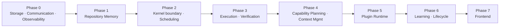

# ABSOLUTE-ZERO V2 — Development Roadmap

Build order for the 14-component Agentic OS. The governing principle:
**substrate before consumers, boundaries before intelligence, gates before the
code they gate.** A component is built only after everything it depends on is
real and tested, so every integration is against working parts, never mocks
that hide interface drift.

This roadmap covers architecture milestones, implementation order, testing
order, integration order, and per-phase exit criteria. No implementation
detail — that lives in `COMPONENTS/*.md`.

---

## Dependency-driven build order

The brief's suggested order is adopted with one deliberate refinement:
**Verification is built in the same phase as Execution, immediately after it.**
Rationale — Verification's own lifecycle *delegates all process execution to
Execution* (it never spawns), so it cannot be exercised end-to-end until
Execution exists; and building the gate right after the thing it gates lets us
prove Law 4 (unskippable gates) before any intelligence component can be tempted
to route around it. Everything else follows the given order.

---

## Phase 0 — Foundations (Storage, Communication, Observability)

Nothing durable, nothing communicated, and nothing observed can exist before
these three. They are the substrate every later component leans on.

**Build order within phase:** Storage → Communication → Observability
(Observability persists via Storage and rides Communication).

- **Storage** — atomic/locked/transactional writes, config source of truth,
  vault layout, git integration. Establishes Law 3 (one writer) from day one.
- **Communication** — event bus, message schema, topic registry, delivery
  semantics (per-topic FIFO, at-least-once, dead-letter).
- **Observability** — unified telemetry schema, single sink, token/cost
  accounting, episodic trace store.

**Milestones:** durable write survives concurrent writers without loss (H5);
an event round-trips publisher→bus→subscriber with at-least-once + idempotency;
a telemetry event lands in the one sink with correct schema.

**Testing order:** Storage first (concurrency + atomicity property tests) →
Communication (ordering, redelivery, dead-letter) → Observability (schema
conformance, token/cost math).

**Exit criteria**
- Concurrent multi-writer test shows zero lost updates; every write atomic.
- One config source of truth; no second config path exists.
- `telemetry.emitted`, `storage.committed`, `storage.rejected` flow end-to-end.
- Bus proves per-topic FIFO + at-least-once + dead-lettering.

---

## Phase 1 — Knowledge (Repository Memory)

The single retrieval authority. Built early because nearly every later
component queries it and none may re-implement it (Law 2, fix H2).

**Milestones:** onboard a repo → full index (symbols, structure, conventions,
history); query returns ranked results within a token-budget ceiling with
mandatory ≤25-token summaries; incremental re-index on change.

**Testing order:** index build correctness → query ranking determinism →
budget-ceiling enforcement → incremental re-index equals full re-index.

**Integration:** persists exclusively via Storage; emits `memory.indexed`,
`memory.queried`, `memory.updated` to Observability over the bus.

**Exit criteria**
- Exactly one retrieval/similarity implementation exists in the system.
- Same query + same index → identical ranked result (Law 6).
- Retrieval never exceeds the token budget; every result carries a ≤25-token
  summary.
- No other component reads a repository directly.

---

## Phase 2 — Control plane (Kernel boundary, Scheduling)

The Kernel is defined **only at its boundary** (black box) — admission,
routing, gate mediation — plus its relationships. Scheduling gives us ordering,
budgets, preemption, and backpressure.

**Build order:** Kernel boundary contract first (what it admits/routes/gates),
then Scheduling against that contract.

**Milestones:** a request is admitted (`request.admitted`) and routed;
Scheduling orders work under token+time budgets; preemption and backpressure
observable; the *structural* place where gates are enforced exists (even before
Verification is built, the no-bypass path is wired).

**Testing order:** Kernel admission/routing contract → Scheduling ordering &
budget accounting → preemption/backpressure → the gate-enforcement path has no
bypass edge.

**Exit criteria**
- Kernel exposes only boundary behavior; no internal design leaked into other
  components.
- Scheduling enforces token + time budgets sourced from Observability's
  `cost.recorded`.
- Backpressure signals rather than drops.
- A code-path audit shows no route from "work" to "complete" that skips the
  gate slot.

---

## Phase 3 — Doing work (Execution, then Verification)

**Build order:** Execution → Verification (Verification delegates process runs
to Execution and cannot be exercised without it).

- **Execution** — sole process spawner; sandbox, timeouts, retries, resource
  caps, failure containment. `exec.timeout`/`exec.failed` are ordinary returned
  results, never crashes (fix H4).
- **Verification** — mechanical gates on plans/diffs/artifacts; runs selftests
  of changed + dependent engines by delegating to Execution; verdicts are
  events the Scheduler/Kernel enforce (fix H3, Law 4).

**Milestones:** a runaway subprocess is contained (killed on timeout) without
affecting the caller; the selftest law runs on every change; a `verify.failed`
verdict provably blocks commit and routes to replan.

**Testing order:** Execution containment (timeout kills, no caller crash) →
resource caps/retries → Verification verdict correctness → **gate
enforcement**: attempt to commit over a FAIL and prove it is structurally
impossible.

**Exit criteria**
- Only Execution spawns processes; grep-level audit confirms no other spawner.
- Timeout/failure of a child never propagates as a crash.
- Selftests of changed + dependent engines execute on every change.
- The V1 H3 regression test — "LLM commits over a FAIL" — is unreachable.

---

## Phase 4 — Intelligence (Capability Planning, Context Management)

Now the model earns its keep, fenced on all sides by phases 0–3.

**Build order:** Capability Planning → Context Management (planning defines the
steps whose context must be assembled; both are independent enough to develop
in parallel once interfaces are fixed, but planning's step shape drives
context requirements).

- **Capability Planning** — intent → validated plans: classification is a
  pluggable service with confidence + fallback (never a single keyword-argmax
  authority, fix H1); decomposition quality validated (fix H6); plans are
  verifiable artifacts carrying confidence.
- **Context Management** — sole assembler of the Optimal Context Package:
  pulls from Repository Memory + other memories, ranks, dedups, fits budget,
  fidelity tiers; owns prompt compilation (no separate prompt engine).

**Milestones:** a misclassification degrades gracefully via fallback rather
than cascading; a decomposed plan passes Verification pre-check
(`plan.validated`); a context package is deterministic and within budget.

**Testing order:** classification confidence/fallback → decomposition validity
(no "split on and" bloat) → plan verifiability → context determinism & budget
fit → dedup/fidelity-tier correctness.

**Exit criteria**
- No single classifier is the sole pipeline authority; confidence + fallback
  are first-class.
- Every plan is a verifiable artifact with a confidence score.
- Exactly one context/prompt assembler exists; no duplicate prompt path.
- Same step + same memory state → identical context package (Law 6).

---

## Phase 5 — Extensibility (Plugin Runtime)

**Build order:** Plugin Runtime after Execution (isolation/loading) and
Capability Planning (capability matching consumes the registry).

**Milestones:** discover→register→load(isolated)→health-track a plugin;
capability registry answers "what can do this step"; reliability scoring exists
and is updatable.

**Testing order:** discovery/registration → isolated load (a crashing plugin
cannot take down Execution) → health tracking → registry lookup correctness.

**Integration:** emits `plugin.discovered/registered/loaded/disabled` and
`plugin.health.changed`; consumes `reliability.updated` from Learning (wired in
Phase 6).

**Exit criteria**
- Plugins load in isolation; a faulty plugin is contained and `plugin.disabled`.
- Capability registry is the single source for capability matching.
- Reliability score field exists and is consumed by Capability Planning.

---

## Phase 6 — Compounding & lifecycle (Learning, Lifecycle)

**Build order:** Learning → Lifecycle (Learning closes the moat loop; Lifecycle
formalizes the long-lived state machines now that all their transition-emitting
components exist).

- **Learning** — harvests closed traces (from Observability's episodic store)
  into lessons/faults/pattern stats; updates plugin reliability and planning
  priors; writes only via Storage (Law 3). Realizes "never pay twice."
- **Lifecycle** — state machines for request, repo onboarding/offboarding,
  plugin, and session wake/sleep; owns transition legality.

**Milestones:** a closed trace yields a lesson that changes a later plan;
plugin reliability heals over time; every long-lived object's illegal
transitions are rejected by Lifecycle.

**Testing order:** trace→lesson distillation → reliability update round-trips
to Plugin Runtime + Capability Planning → Lifecycle transition-legality
(illegal transitions rejected) → session wake/sleep.

**Exit criteria**
- `lesson.learned` and `reliability.updated` observably alter future routing.
- Learning writes nothing except via Storage.
- Every state machine in ARCHITECTURE.md is enforced; illegal transitions are
  impossible, not merely discouraged.

---

## Phase 7 — Surface (Frontend)

**Build order:** last. Frontend presents state and never owns it, so it needs
everything beneath it to be real.

**Milestones:** CLI commands drive the full request lifecycle; dashboard reads
from Observability only; presented state is provably read-only.

**Testing order:** CLI request round-trip → dashboard reads-from-Observability
→ read-only invariant (no Frontend write path exists).

**Exit criteria**
- Frontend holds zero authoritative state.
- Dashboards read exclusively from Observability's single sink.
- A full user request completes end-to-end through all 14 components.

---

## Cross-cutting integration order

Integration is incremental and always downhill (new component integrates
against already-proven ones):

1. Storage ↔ Communication ↔ Observability (the substrate triangle).
2. Repository Memory onto the substrate.
3. Kernel boundary + Scheduling onto Repository Memory + substrate.
4. Execution + Verification onto Scheduling (prove the gate).
5. Capability Planning + Context Management onto Verification + Repository Memory.
6. Plugin Runtime onto Execution + Capability Planning.
7. Learning + Lifecycle onto Observability + Plugin Runtime + everything above.
8. Frontend onto the full stack — the end-to-end acceptance run.

## Cross-cutting testing discipline (every phase)

- **Selftest law:** every engine ships a self-check; the verifier executes
  selftests of changed + dependent engines on every change (carried from V1).
- **Determinism tests:** same inputs → same routing / context / verdicts (Law 6).
- **Boundary audits:** each phase re-runs the single-owner audit — one writer,
  one spawner, one retriever, one bus, one context assembler — to catch drift
  before it compounds (the V1 god-module root cause).
- **Observability-complete:** no component ships until every action it takes
  emits a telemetry event (Law 7).

## Architecture milestones (summary)

| Milestone | Achieved in |
|-----------|-------------|
| No-lost-update durable writes | Phase 0 |
| Single retrieval authority live | Phase 1 |
| Budgeted, backpressured control plane | Phase 2 |
| Structurally unskippable verification gate | Phase 3 |
| Deterministic planning + context, fenced LLM | Phase 4 |
| Self-healing plugin ecosystem | Phase 5 |
| Compounding memory + enforced state machines | Phase 6 |
| End-to-end request through all 14 components | Phase 7 |
